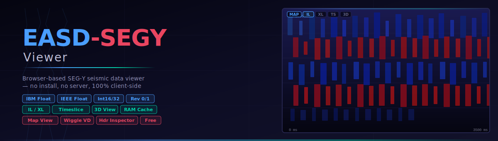

<p align="center">
  
</p>

<p align="center">
  <a href="https://sadaqat-ali-syed.github.io/SEGY-Viewer/">
    
  </a>
  &nbsp;
  
  &nbsp;
  
  &nbsp;
  
</p>

---

**EASD-SEGY Viewer** is a fully self-contained, browser-based SEG-Y seismic data viewer. Drop a `.segy` or `.sgy` file and instantly explore inlines, crosslines, timeslices, a 2-D map, and an interactive 3-D preview — with zero installation, zero server, and zero data leaving your machine.

---

## Features

### Data Format Support
- **IBM Float32** (format code 1) — the classic SEG-Y floating-point encoding
- **IEEE Float32** (format code 5) — modern 32-bit IEEE floats
- **Int32 / Int16 / Int8** (format codes 2, 3, 8)
- **SEG-Y Rev 0 and Rev 1** — auto-detects revision from the binary header
- Handles non-standard byte locations for Inline / Crossline / CDP-X / CDP-Y / Coord Scalar via configurable byte-location inputs

### Views
| View | Description |
|------|-------------|
| **Map** | Dot-plot of the full survey footprint, colour-coded by inline, with clickable trace navigation |
| **Inline** | Full variable-density (VD), wiggle, or combined VD+wiggle section |
| **Crossline** | Same display options as inline |
| **Timeslice** | Horizontal amplitude slice at any two-way time |
| **3D Preview** | Interactive Three.js cube showing IL, XL, and TS face textures simultaneously; drag to orbit, scroll to zoom |

### Setup & Header Inspection (pre-scan)
When a file is opened, a **Setup Modal** appears before any data is scanned, letting you:
- Read the **EBCDIC** textual header (C01–C40 lines)
- Browse the **Binary File Header** (NS, dt, format, revision…)
- Navigate any **Trace Header** with full 240-byte field decoding and one-click **Set As** buttons to assign IL / XL / X / Y / SC byte locations
- Run a **100-Trace Summary** scan to verify byte assignments and detect the actual IL/XL range before committing to a full load
- Set a **custom IL/XL range** to load only a sub-volume, then choose **Scan Full Volume** or **Scan Selected Range Only**

### Performance
- **RAM Cache** — loads all sample data into a typed `Float32Array` in browser memory for instant section switching without re-reading the file
- **Batch scanning** — trace headers read in chunks of 500 for smooth progress reporting with cancel support
- **On-demand loading** — sections are read lazily; only what you view is decoded

### Display Options
- **Colormaps**: Seismic Blue/White/Red, Red/White/Blue, Blue/White/Black, Greyscale, Rainbow, Plasma, Viridis, Inferno
- **Gain control** — amplitude percentile clip slider (1%–100%)
- **Display mode** — Variable Density, Wiggle, or combined VD + Wiggle overlay
- **Zoom & pan** — mouse wheel zoom, drag to pan, keyboard arrow navigation between lines
- **Map dot size** — adjustable trace footprint size

### Header Inspector
- Full **EBCDIC / Binary / Trace header** inspector accessible from the toolbar at any time after loading
- Trace header shows all 90 standard SEG-Y Rev 1 fields with types, values, and one-click **Set As** buttons to reassign byte locations on the fly

---

## Quick Start

### Option 1 — Use the live demo
> 🔗 **[Open in browser — no download needed](https://sadaqat-ali-syed.github.io/SEGY-Viewer/)**

### Option 2 — Run locally
```bash
# Clone or download the repository
git clone https://github.com/sadaqat-ali-syed/SEGY-Viewer.git

# Open the viewer — no web server required
open SEGY-Viewer/segy_viewer.html   # macOS
start SEGY-Viewer\segy_viewer.html  # Windows
xdg-open SEGY-Viewer/segy_viewer.html  # Linux
```

### Option 3 — Download the single file
Download [`segy_viewer.html`](segy_viewer.html) and open it directly in any modern browser. That's it.

---

## Usage

1. **Open a file** — drag & drop a `.segy` / `.sgy` file onto the viewer, or click **Open File**
2. **Inspect headers** — the Setup modal appears automatically:
   - Check the EBCDIC text header for survey/byte-location documentation
   - Browse the Binary Header to confirm NS, dt, and format
   - Use the **Trace Header** tab to find the correct byte positions for IL, XL, X, Y, SC
   - Click **Set As** on any field to assign it as a byte location
   - Use **100 Traces** to scan the first 100 trace headers and verify the byte assignments
3. **Set range** (optional) — enter IL/XL limits to load only a sub-volume
4. **Scan** — click **Scan Full Volume** or **Scan Selected Range Only**
5. **Navigate** — switch between Map, IL, XL, TS, and 3D tabs; use the sliders or arrow keys to step through lines
6. **Load to RAM** — click **⬇ Load to RAM** in the sidebar for instant section switching on larger datasets

---

## Keyboard Shortcuts

| Key | Action |
|-----|--------|
| `←` / `→` | Previous / next inline (in IL view) |
| `←` / `→` | Previous / next crossline (in XL view) |
| `Shift + ←/→` | Jump 5 lines at a time |
| `Enter` | Load current section |
| `Escape` | Close any open modal |

---

## Browser Compatibility

Works in any modern browser that supports the File API and WebGL (required for 3D view).

| Browser | Supported |
|---------|-----------|
| Chrome / Edge | ✅ Full support |
| Firefox | ✅ Full support |
| Safari | ✅ Full support (macOS/iOS) |
| Opera | ✅ Full support |

> **Note:** Files are processed entirely in the browser. No data is uploaded to any server.

---

## Repository Structure

```
SEGY-Viewer/
├── index.html          ← GitHub Pages entry point (redirects to viewer)
├── segy_viewer.html    ← The complete application (single file)
├── banner.svg          ← Project banner graphic
└── README.md           ← This file
```

---

## Technical Notes

- **IBM Float32 decoder** implemented in JavaScript — sign × mantissa/2²⁴ × 16^(exp−64)
- **Three.js r128** used for 3D rendering (loaded from CDN, no local dependency)
- **No frameworks, no build step** — pure vanilla JS + HTML + CSS
- File I/O uses `FileReader` / `Blob.slice()` for random-access reads without loading the whole file into memory
- The RAM cache allocates a single `Float32Array(nTraces × nSamples)` and uses a `Map<offset → index>` for O(1) trace lookup

---

## License

MIT License — free to use, modify, and distribute.

---

<p align="center">
  Made for geoscientists who just want to look at their data.
</p>
